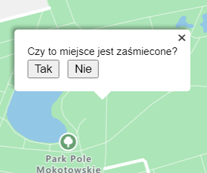
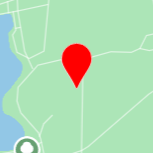
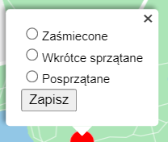
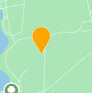
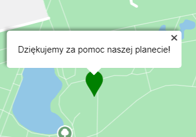

### **[LINK DO APLIKACJI](http://zglaszanie-smieci.azurewebsites.net/)**

# Zglaszanie-smieci-on-azure
Aplikacja webowa do zgłaszania lokalizacji śmieci stworzona z wykorzystaniem usługi Microsoft Azure Maps

# Architektura

# Demo video
pojawi się wkrótce

# Zespół
Szymon Kuś - https://github.com/ogoras

Paweł Cegielski - https://github.com/Skokus

# Opis funkcjonalności
Program ma posiadać następujące opcje:
* aplikacja przyjmuje zgłoszenia śmieci z wybranej lokalizacji
* aplikacja pokazuje na mapie punkty zaśmiecone
* aplikacja pozwala na usunięcie miejsca zaśmieconego - posprzątanie
* aplikacja pozwala na zdementowanie zgłoszenia

# Schemat działania rozwiązania
Aby **zgłosić** miejsce zaśmiecone, należy:
  1. Kliknąć lewym przyciskiem myszy/dotknąć krótko ekranu w odpowiedniej lokalizacji. Pojawi się następujące menu:

  2. Wybrać "Tak". Na mapie pojawi się czerwony marker. Wybranie "Nie" lub naciśnięcie krzyżyka anuluje operację.

Aby **posprzątać** miejsce zaśmiecone, należy:
  1. Kliknąć prawym przyciskiem myszy/przytrzymać palcem istniejący czerwony znacznik. Pojawi się następujące menu:

  2. Wybrać opcję "Wkrótce sprzątane" i kliknąć "Zapisz". W ten sposób zakomunikujesz innym użytkownikom, że posprzątasz to miejsce. Marker zmieni kolor na pomarańczowy:

  3. Po posprzątaniu miejsca ponownie wejść w menu opcji znacznika i wybrać opcję "Posprzątane" i kliknąć "Zapisz". Marker zmieni kolor na zielony i po chwili zniknie:

Aby **zdementować** zgłoszenie śmieci (jest marker w miejscu, gdzie nie ma śmieci), należy wykonać punkt 3 z procedury sprzątania.

# Wybrany stos technologiczny
* Vanilla js
* Node.js + Express
* MS SQL
